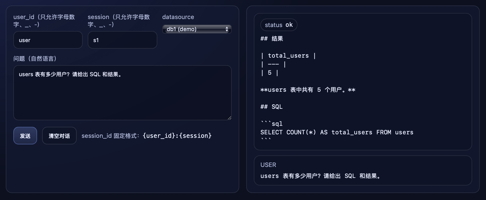
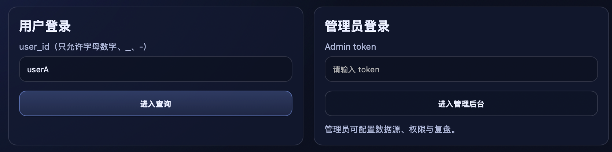

# DataSSA

面向可信查询的多数据库 Agent Runtime：将一次数据提问标准化为可控闭环
`NL → SQL → 安全校验 → 执行 → 结果解读`，并落盘 **trace（可回放）** 与 **audit（可审计）**。

# 功能概览

> 仓库内置静态前端页面：`/login`、`/app`、`/admin`；后端为 FastAPI。

<p align="center">
  
  
  
</p>


## Capabilities

- **Safe, read-only queries**：强制只允许 `SELECT/WITH`，拦截注入/多语句/危险关键字（执行面不可绕过）
- **Multi-datasource runtime**：每个数据源独立 MCP 子进程与并发配额，降低串库与互相拖垮风险
- **Traceable & auditable**：trace（事件流）+ audit（执行面日志）通过 `trace_id` 关联，支持回放与审计

---

## Highlights

- **安全边界清晰**：设置四层安全边界：

  - SQL 语句解析，只允许 SELECT 和 WITH 开头的查询；
  - 危险关键字检测，拦截 DROP、DELETE、UPDATE 等 14 个危险关键字；
  - 注入模式检测，用正则匹配 UNION SELECT、OR 1=1 等 12 种常见注入模式；
  - 多语句检测，禁止分号分隔的多语句执行。
- **资源限制**：查询超时 30 秒自动中断，结果限制 1000 行，并发控制最多 5 个查询。
- **完整审计日志**：每次查询都记录 SQL、执行时间、返回行数；被拦截的危险查询也会记录，用于安全分析。
- **循最小权限原则**：只暴露 4 个工具——query_database、list_tables、describe_table、get_statistics，每个工具职责明确、边界清晰。
- **多模式设计**：项目提供 SQL + 自然语言双模式。SQL 模式用于快速检索，延迟低，减少不必要的 token 消耗；自然语言模式可以更好地用于探索性问题，生成分析报告等。

---

## Repository layout

- `server/main.py`：FastAPI（`/login` `/app` `/admin` `/chat` `/replay/*`）
- `datasaa_runtime/agent.py`：AgentCore（会话/记忆/tool-call loop/trace）
- `datasaa_runtime/skills/safe_query.py`：可信查询闭环 skill（schema→SQL→QueryBus→verify→report）
- `datasaa_runtime/querybus.py`：执行平面（统一 `validate_sql → query_database`，并发隔离）
- `mcp_server/db_server.py`：只读 DB MCP Server（强制安全校验 + 审计日志）
- `data/`：示例数据库/数据文件
- `workspace/`：运行时状态（sessions/traces/memory/datasources/permissions）
- `audit.log`：审计日志（运行时生成）

---

## Quickstart

### 1) 安装依赖

```bash
cd database-agent
python3 -m venv .venv
source .venv/bin/activate
pip install -r requirements.txt
```

### 2) Configure database (sqlite demo)

```bash
export DB_PATH="./data/business.db"
```

### 3) Start server (test-mode)

test-mode 不依赖外部 LLM，用于本地演示/回归/评测：

```bash
export DATASSA_TEST_MODE=1
export DATASSA_ADMIN_TOKEN=devtoken
./bin/database-agent api --host 127.0.0.1 --port 18790
```

Open:

```bash
http://127.0.0.1:18790/login
```

Screenshots:

- `docs/assets/login.jpg`
- `docs/assets/app.jpg`
- `docs/assets/admin.jpg`

### 4) Start server (LLM mode)

```bash
export LLM_API_KEY="sk-xxx"
export LLM_API_BASE="https://api.deepseek.com"
export LLM_MODEL="deepseek-reasoner"
unset DATASSA_TEST_MODE
./bin/database-agent api --host 127.0.0.1 --port 18790
```

### 5) Evaluation

> 多数据源在 `/admin` 页面配置（落盘到 `workspace/datasources/index.json`），并由 MCP 子进程按数据源策略启动。

---

## Docker

Docker 下 DB 文件通过 volume 挂载到容器内 `/app/data`

```bash
cd database-agent
docker compose up -d --build
docker compose exec -it database-agent ./bin/database-agent api --host 0.0.0.0 --port 18790
```

---
