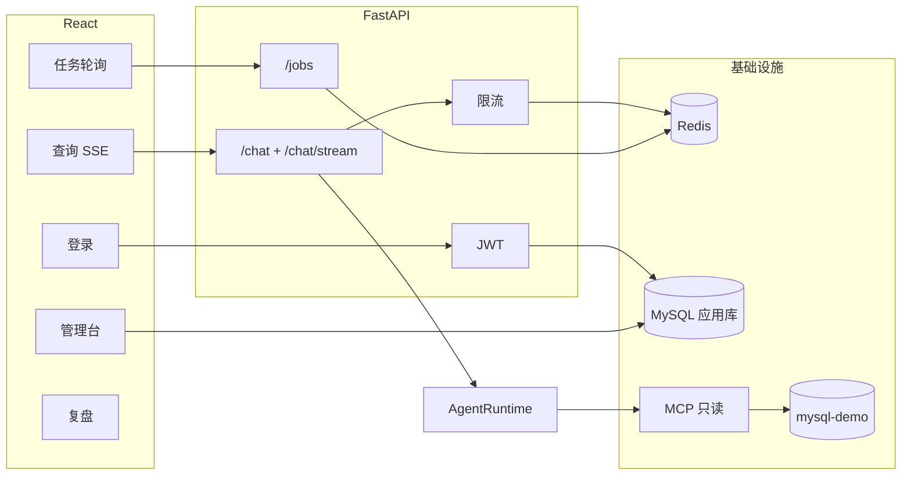

# DataSSA 全栈 6 周开发计划

> 定稿日期：2026-05-20  
> 状态：已确认，按周执行  
> 说明：代码主要由 AI 实现；本人负责验收、理解与每周学习笔记。

---

## 0. 目标与原则

| 项 | 约定 |
|----|------|
| **周期** | 业余 6 周，每周约 12–15 小时 |
| **角色分工** | 定范围、跑通、自测、写每周学习笔记；代码实现以 AI 为主 |
| **前端** | React + TypeScript + Ant Design **默认样式**；功能齐全即可，不追求 UI 美化 |
| **后端** | 分层 FastAPI + MySQL（应用库）+ Redis + JWT + 限流 + SSE + `/jobs` + MySQL 只读查询源 |
| **核心保留** | `datasaa_runtime` + MCP 安全链 + QueryBus（可信查询差异化） |
| **注册策略** | `POST /auth/register` 仅开发环境开启（`ALLOW_REGISTER=1`），避免 demo 被随意注册 |

**6 周后对外一句话：**

> 企业式数据分析助手：React 前台 + JWT；同步/SSE 查数；Redis 限流与任务状态；异步 Job；MySQL 管理配置与权限；MCP 只读查询 SQLite/MySQL；trace/audit 可追溯。

---

## 1. 技术栈（固定）

```text
前端：React 18 + TypeScript + Vite + React Router + TanStack Query + Ant Design（默认主题）
后端：FastAPI（api / services / repositories）+ SQLAlchemy 2 + Alembic
应用库：MySQL 8 — users, datasources, permissions, jobs
辅助：Redis 7 — 限流、job 热状态、schema 缓存
异步：ARQ + 独立 worker 容器（第 4 周；此前可用 BackgroundTasks 过渡）
流式：SSE — POST /api/v1/chat/stream
查询：MCP 扩展 mysql 只读 + 现有 sqlite；QueryBus 不变
部署：docker-compose — api, worker, web, mysql, redis, mysql-demo
测试：pytest 冒烟（auth / 限流 / job / sse）；前端不做 E2E
```

---

## 2. 架构示意



| 技术 | 在本项目中的用途 |
|------|------------------|
| **MySQL（应用库）** | 用户、角色、数据源元数据、权限、job 记录 |
| **MySQL（查询源）** | MCP 只读连接 `mysql-demo` 样例库 |
| **Redis** | 限流计数、Job 热状态与进度、schema 缓存 |
| **限流** | 按 `user_id` 保护 `/chat` 等；返回 429 |
| **SSE** | 流式推送 phase / sql / delta / done |
| **/jobs** | 长任务异步；MySQL 持久 + Redis 热读 |

---

## 3. 前端范围

### 必做页面

| 页面 | 能力 |
|------|------|
| 登录/注册 | 表单、token、路由守卫（注册受 `ALLOW_REGISTER` 控制） |
| 查询台 | 数据源、session、提问；同步 + SSE 流式 |
| 任务 | 提交 job、轮询状态、展示结果 / trace_id |
| 管理台 | 数据源 CRUD、测试连接、权限、默认源（`role=admin`） |
| 复盘 | trace 列表 + 详情（表格 + 简单时间线） |

### 明确不做

- 自定义设计系统、暗色主题、精细响应式
- 图表可视化（ECharts 等）；结果用表格即可
- i18n、移动端适配
- Playwright / Vitest 前端测试

---

## 4. 六周排期

### 第 1 周 — 底座 + MySQL + JWT + React 脚手架

**交付**

- `server/` 分层：`config`, `api/v1`, `services`, `deps`, `middleware`
- `docker-compose`：`mysql`, `redis`, `api`（worker/web 可先占位）
- Alembic：`users`（username, password_hash, role: `user` | `admin`）
- API：`POST /api/v1/auth/register`（需 `ALLOW_REGISTER=1`）、`/login`、`GET /me`
- React：Vite 工程、登录页、axios + token、路由守卫

**验收**

- `docker compose up` 后注册/登录成功
- 无 token 访问受保护接口返回 401

**精读建议**

- `server/deps.py`（当前用户）
- `server/api/v1/auth.py`
- JWT / Settings 配置

---

### 第 2 周 — 同步 Chat + Redis 限流 + 查询页

**交付**

- `POST /api/v1/chat`：JWT 解析 `user_id`，包装 `AgentRuntime.process`
- Redis 限流：如 `rl:chat:{user_id}` 30 次/分钟；429 + `Retry-After`
- MySQL：`datasources`、`permissions` 表 + Repository
- React 查询页：表单 + 结果（answer / sql / warnings）；429 Toast
- 可选：从 `workspace/datasources` 导入 MySQL 的脚本

**验收**

- test-mode 或 LLM 模式下完成一次查询
- 快速重复请求触发 429

**精读建议**

- 限流 middleware
- chat service
- 前端 `useMutation` 与错误处理

---

### 第 3 周 — SSE 流式 + Admin（够用即可）

**交付**

- `POST /api/v1/chat/stream`：SSE 事件 `phase` | `sql` | `delta` | `done` | `error`
- Redis：`cache:schema:{datasource_id}`，TTL 1h
- React：查询页支持流式；Ant Design `Steps` 展示阶段
- Admin：数据源 CRUD + 测试连接；权限表；admin 路由守卫

**验收**

- DevTools 可见 `text/event-stream`
- Admin 修改数据源后，查询页列表同步更新

**精读建议**

- SSE 路由实现
- 一个 Admin CRUD 页面
- schema 缓存读写

---

### 第 4 周 — /jobs 异步 + Worker + Redis 状态

**交付**

- MySQL `jobs` 表：status, user_id, trace_id, error, timestamps
- Redis：`job:{id}:status`, `job:{id}:progress`
- API：`POST /api/v1/jobs`（202）、`GET /api/v1/jobs/{id}`
- Worker：ARQ 消费队列，调用 Agent / safe_query
- React 任务页：提交 + 轮询（React Query `refetchInterval`）

**验收**

- 提交 job → 202 → 轮询至 `succeeded` → 展示结果

**精读建议**

- Job 状态机
- worker 入口
- MySQL 与 Redis 双写分工

**备注**

- 若 ARQ 阻塞，可先用 BackgroundTasks + Redis 跑通 UI，再补 worker 容器

---

### 第 5 周 — MySQL 只读数据源（MCP）

**交付**

- MCP / 连接层：`type=mysql`，只读 DSN，超时与 max_rows
- 应用库：DSN 加密存储；列表接口脱敏
- `mysql-demo` 容器 + 初始化 SQL
- Admin：类型 `mysql` + 测试连接
- 端到端：SQLite demo 与 MySQL demo 各成功一次

**验收**

- 查询台选择 MySQL 源并完成只读查询

**精读建议**

- `mcp_manager` 启动 MySQL 子进程
- audit 中 `datasource_id` 关联

---

### 第 6 周 — 联调、测试、文档、可展示

**交付**

- pytest：login、chat（test-mode）、限流 429、job 生命周期、SSE 冒烟
- `docker-compose` 终版：`api + worker + web + mysql + redis + mysql-demo`
- `docs/architecture.md`、`docs/PROJECT_STORY.md`（面试用 1 页）
- 可选 3 分钟录屏：登录 → SSE → 限流 → job → Admin 配 MySQL

**验收**

- 按文档 30 分钟内可跑通全链路
- 能口述 5 分钟：请求从 React 到 MCP 的路径

**Roadmap（本期不做）**

- OIDC / SSO
- PostgreSQL 数仓、Prometheus 大盘
- Playwright E2E
- 前端 UI 精修

---

## 5. 每周固定动作

| 时间 | 动作 |
|------|------|
| 周一 | 将本周「交付 + 验收」发给 AI，要求仅做本周范围 |
| 周三 | `docker compose up`，跑完本周验收清单 |
| 周五 | 填写 `docs/learning/weekN.md`（5 条，手写） |
| 周末 | 对照架构图出声讲一遍（约 2 分钟） |

**AI 每周必须回报**

1. 变更文件列表  
2. 新增/变更 API 表  
3. `docker-compose` 服务列表  
4. 精读 3 个文件路径  
5. 自测 checklist  

**Prompt 模板**

```text
阶段：第 N 周（见 docs/ROADMAP_6W.md）
范围：只做该周交付项，禁止扩散到 Roadmap「本期不做」
技术：React + JWT + MySQL + Redis；第 N 周特定项：...
验收：<粘贴该周验收>
完成后请给出：变更文件、API 表、compose 服务、精读 3 文件、自测 checklist
```

---

## 6. 6 周结束自检（知识覆盖）

- [ ] JWT 登录与 FastAPI `Depends` 鉴权
- [ ] MySQL 建模与 Alembic 迁移
- [ ] Redis：限流 key、TTL 缓存、job 热状态
- [ ] HTTP 429 与前端错误提示
- [ ] SSE 事件类型与前端 stream 消费
- [ ] Job 状态机与 api/worker 分离
- [ ] MySQL 应用库 vs MySQL 查询源的区别
- [ ] Docker 多容器联调
- [ ] pytest 集成冒烟

---

## 7. 风险与缓冲

| 风险 | 对策 |
|------|------|
| 第 4 周 worker 复杂 | BackgroundTasks + Redis 先跑通 UI，再补 ARQ |
| 第 5 周 MCP MySQL 困难 | 先 `SELECT 1` / 单表查询测通，再接 NL |
| 时间不足 | 砍：录屏、refresh token、replay 页美化；**不砍**：限流、SSE、job、MySQL |

---

## 8. 学习笔记模板（每周复制到 `docs/learning/weekN.md`）

```markdown
# 第 N 周学习笔记

日期：

## 本周我做的验收（打勾）
- [ ] ...

## 五条要点（自己写，不要 AI 代写）
1.
2.
3.
4.
5.

## 我能讲清的链路（一句话）
>

## 遇到的问题与解决
-
```

---

## 9. 相关文档（随开发补充）

| 文件 | 说明 |
|------|------|
| `docs/ROADMAP_6W.md` | 本文档 |
| `docs/learning/week1.md` … `week6.md` | 每周笔记（第 1 周起自行创建） |
| `docs/architecture.md` | 第 6 周补充架构说明 |
| `docs/PROJECT_STORY.md` | 第 6 周补充面试叙事 |
| `docs/docs/项目逻辑复盘.md` | 现有 Runtime 逻辑导览 |

---

## 10. 执行入口

确认落盘后，从 **第 1 周** 开始实施。启动指令示例：

```text
按 docs/ROADMAP_6W.md 执行第 1 周：拆 server + docker mysql/redis + Alembic users + JWT + React 登录。
ALLOW_REGISTER=1 仅 dev。不要改 README。
```
